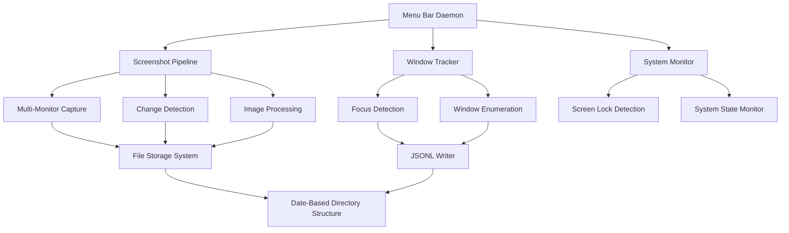

# Design Document: ActivityBeacon Screenshot Capture System

## Overview

The ActivityBeacon Screenshot Capture System is a macOS-native application that automatically captures multi-monitor screenshots with intelligent change detection and comprehensive window focus tracking. The system consists of a menu bar daemon that runs continuously, capturing screenshots only when meaningful changes occur, and storing both visual data and window metadata in an organized, date-based file structure.

The core design emphasizes efficiency through change detection, seamless macOS integration using native frameworks, and robust data organization for downstream processing by existing timelapse and viewer components.

## Architecture

### High-Level System Architecture



### Component Interaction Flow

The system operates on a timer-based capture cycle:

1. **Capture Trigger**: Timer fires at configurable intervals (default: every few seconds)
2. **System State Check**: Verify screen is not locked using Quartz APIs
3. **Screenshot Capture**: Capture all monitors using mss library
4. **Image Processing**: Scale and stitch monitors into single wide image
5. **Change Detection**: Compare with previous screenshot using numpy pixel analysis
6. **Conditional Storage**: Save only if pixel difference exceeds threshold
7. **Window Data Collection**: Gather focus and window information using AppKit/Quartz
8. **Metadata Storage**: Write window data as JSONL format

## Components and Interfaces

### Screenshot Pipeline

**Purpose**: Handles multi-monitor screenshot capture, processing, and change detection.

**Key Classes**:
- `ScreenshotCapture`: Coordinates multi-monitor capture using mss
- `ImageProcessor`: Handles scaling, stitching, and format conversion
- `ChangeDetector`: Implements pixel-difference analysis using numpy

**Interfaces**:
```python
class ScreenshotPipeline:
    def capture_all_monitors() -> List[PIL.Image]
    def process_images(images: List[PIL.Image]) -> PIL.Image
    def detect_change(current: PIL.Image, previous: PIL.Image) -> bool
    def save_screenshot(image: PIL.Image, filepath: str) -> bool
```

**Multi-Monitor Processing**:
1. Enumerate all monitors using screeninfo
2. Capture each monitor separately with mss
3. Determine highest resolution among all monitors
4. Scale each image to match highest resolution (preserve aspect ratio)
5. Stitch horizontally left-to-right into single wide image

### Window Tracking System

**Purpose**: Tracks active applications and enumerates all visible windows using macOS APIs.

**Key Classes**:
- `FocusTracker`: Uses AppKit.NSWorkspace for active application detection
- `WindowEnumerator`: Uses Quartz.CGWindowListCopyWindowInfo for window listing
- `WindowDataCollector`: Aggregates focus and window data into structured format

**Interfaces**:
```python
class WindowTracker:
    def get_focused_application() -> FocusedAppData
    def enumerate_visible_windows() -> List[WindowInfo]
    def collect_window_data() -> WindowDataEntry
```

**Data Structures**:
```python
@dataclass
class FocusedAppData:
    app_name: str
    app_pid: int
    window_name: str

@dataclass
class WindowInfo:
    app_name: str
    window_name: str
    owner_pid: int
    is_active: bool
    is_focused_window: bool

@dataclass
class WindowDataEntry:
    timestamp: str  # ISO format
    focused_app_name: str
    focused_app_pid: int
    focused_window_name: str
    windows: List[WindowInfo]
```

### System Integration Layer

**Purpose**: Provides macOS-specific system integration and state monitoring.

**Key Classes**:
- `SystemStateMonitor`: Monitors screen lock status using Quartz
- `MenuBarController`: Manages PyQt6 menu bar interface
- `PermissionManager`: Handles screen recording permissions

**Interfaces**:
```python
class SystemIntegration:
    def is_screen_locked() -> bool
    def check_screen_recording_permission() -> bool
    def create_menu_bar_interface() -> QSystemTrayIcon
```

### File Storage System

**Purpose**: Manages organized storage of screenshots and metadata in date-based directory structure.

**Key Classes**:
- `DateDirectoryManager`: Creates and manages YYYY/MM/DD directory structure
- `ScreenshotWriter`: Handles PNG file writing with proper naming
- `JSONLWriter`: Manages newline-delimited JSON writing for window data

**Interfaces**:
```python
class FileStorageSystem:
    def ensure_date_directory(date: datetime.date) -> Path
    def save_screenshot(image: PIL.Image, timestamp: datetime) -> Path
    def append_window_data(data: WindowDataEntry, date: datetime.date) -> bool
    def get_screenshot_path(timestamp: datetime) -> Path
```

**Directory Structure**:
```
~/Documents/Screenshots/
├── 2025/
│   ├── 01/
│   │   ├── 15/
│   │   │   ├── 20250115_143022.png
│   │   │   ├── 20250115_143027.png
│   │   │   └── window_data.jsonl
│   │   └── 16/
│   └── 02/
```

## Data Models

### Screenshot Data Model

**File Naming Convention**: `YYYYMMDD_HHMMSS.png`
- Zero-padded date and time components
- PNG format for lossless compression
- Stored in date-specific directories

**Image Format**:
- Multi-monitor images stitched horizontally
- Scaled to highest resolution among monitors
- Aspect ratios preserved during scaling
- RGB color space

### Window Data Model

**JSONL Format** (Critical: NOT a JSON array):
```jsonl
{"timestamp": "2025-01-15T14:30:22.123456", "focused_app_name": "Code", "focused_app_pid": 1234, "focused_window_name": "main.py", "windows": [{"app_name": "Code", "window_name": "main.py", "owner_pid": 1234, "is_active": true, "is_focused_window": true}]}
{"timestamp": "2025-01-15T14:30:27.654321", "focused_app_name": "Safari", "focused_app_pid": 5678, "focused_window_name": "GitHub", "windows": [{"app_name": "Safari", "window_name": "GitHub", "owner_pid": 5678, "is_active": true, "is_focused_window": true}]}
```

**Field Specifications**:
- `timestamp`: ISO 8601 format with microseconds
- `focused_app_name`: String, application name from NSWorkspace
- `focused_app_pid`: Integer, process ID from NSWorkspace
- `focused_window_name`: String, window title from focused application
- `windows`: Array of all visible windows with metadata

### Configuration Data Model

**Capture Settings**:
```python
@dataclass
class CaptureConfig:
    capture_interval_seconds: int = 5
    change_detection_threshold: int = 10
    screenshot_directory: Path = Path.home() / "Documents" / "Screenshots"
    log_directory: Path = Path.home() / ".logs" / "snap_span"
    max_log_files: int = 30
```

## Error Handling

### Exception Management Strategy

The system implements a layered error handling approach:

1. **System-Level Errors**: Screen recording permissions, system API failures
2. **File I/O Errors**: Disk space, permissions, directory creation failures
3. **Data Processing Errors**: Image processing failures, JSON parsing errors
4. **Configuration Errors**: Invalid settings, missing dependencies

### Error Recovery Mechanisms

**Screenshot Capture Failures**:
- Log error and continue with next capture cycle
- Maintain previous screenshot for change detection
- Notify user via menu bar icon status

**File Storage Failures**:
- Retry with exponential backoff (up to 3 attempts)
- Fall back to temporary directory if main storage fails
- Alert user when storage issues persist

**Window Data Collection Failures**:
- Continue screenshot capture even if window data fails
- Log specific API errors for debugging
- Gracefully handle missing window information

### Logging Strategy

**Log File Organization**:
- Daily rotating logs in `~/.logs/snap_span/`
- Format: `snap_scan_YYYYMMDD.log`
- Automatic cleanup after 30 days
- Both file and console handlers for development

**Log Levels**:
- `ERROR`: System failures, permission issues, critical errors
- `WARNING`: Recoverable failures, performance issues
- `INFO`: Capture events, configuration changes
- `DEBUG`: Detailed operation tracing (development only)

## Testing Strategy

### Unit Testing Approach

The system uses comprehensive unit testing to verify functionality:

**Core Component Testing**:
- Test specific monitor configurations (2 monitors, 3 monitors, different resolutions)
- Test image processing with known input/output pairs
- Test change detection with controlled image differences
- Test JSONL parsing with valid and invalid data samples
- Test timestamp formatting and validation
- Test error conditions with mock system APIs

**Integration Testing**:
- Test complete capture cycle from screenshot to file storage
- Test window data collection and storage workflow
- Test system state monitoring and capture pause/resume
- Test error handling and recovery mechanisms

**Test Organization**:
- Unit tests co-located with source files using `.test.py` suffix
- Integration tests in separate `tests/` directory
- Mock system APIs for consistent testing across environments
- Test data fixtures for realistic scenarios

**Test Coverage Focus**:
- All public interfaces and methods
- Error conditions and edge cases
- File I/O operations and data persistence
- System integration points (macOS APIs)
- Configuration and logging functionality
